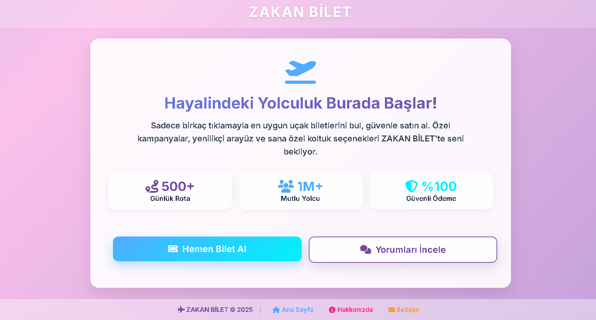
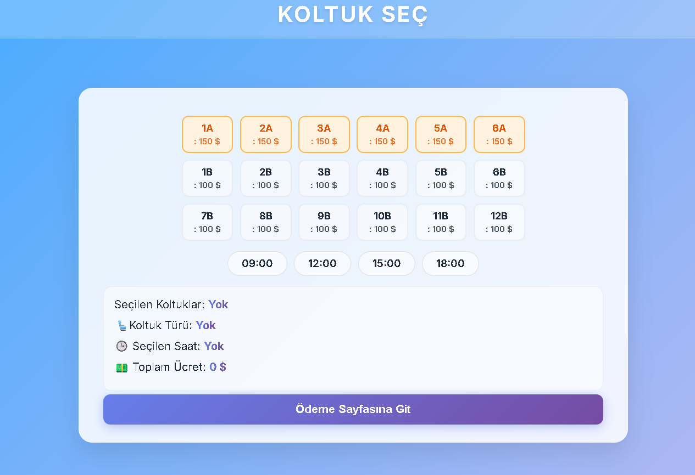
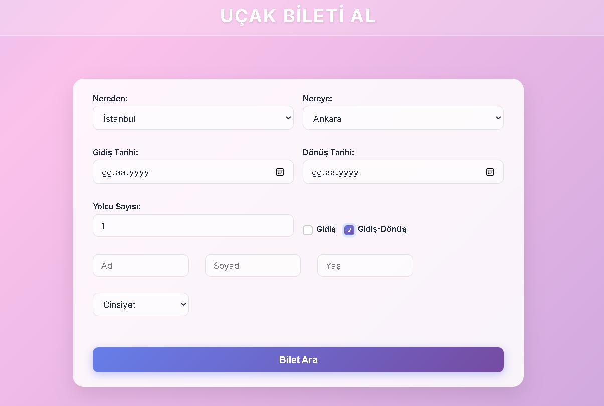
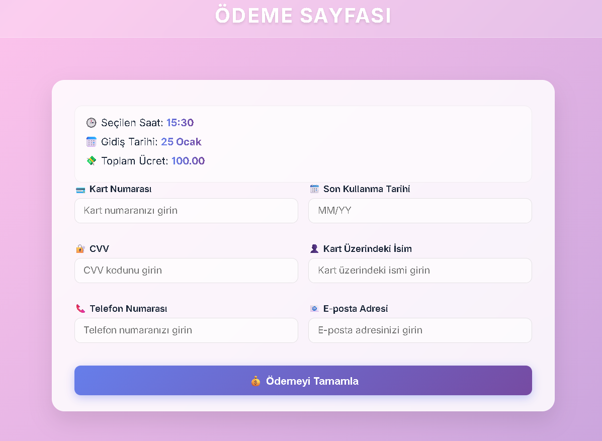
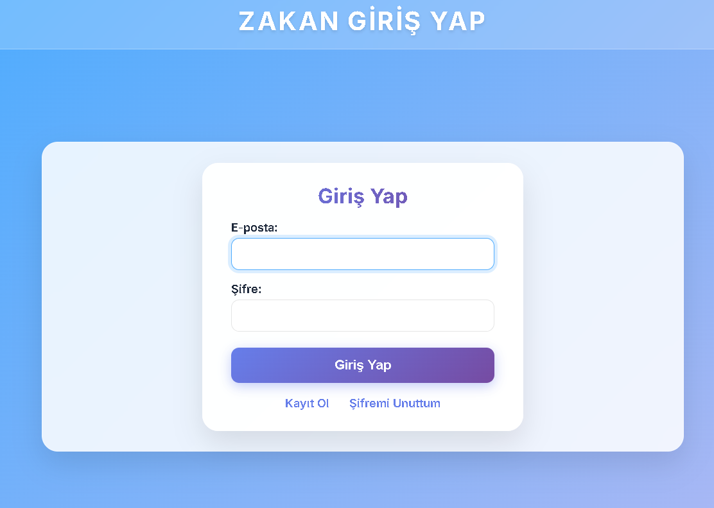
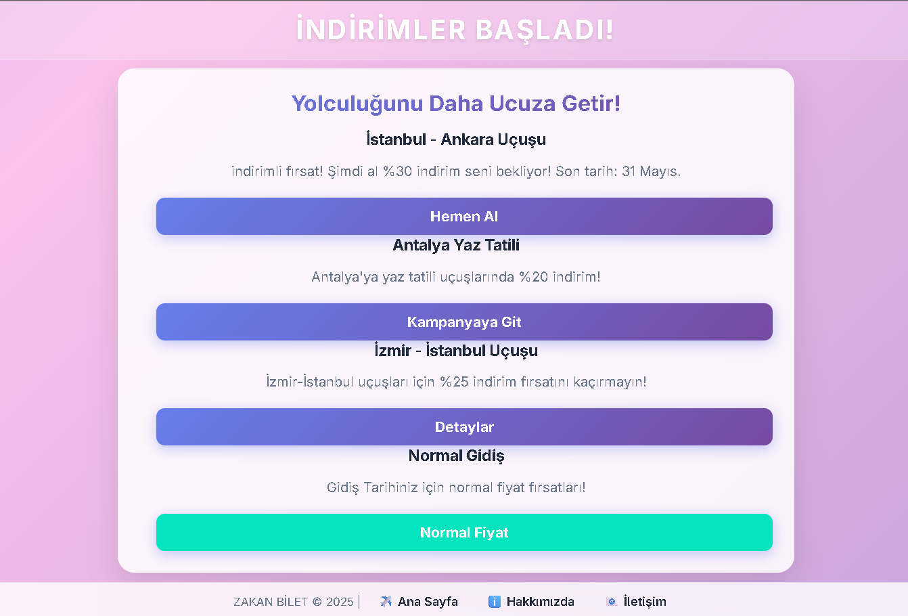
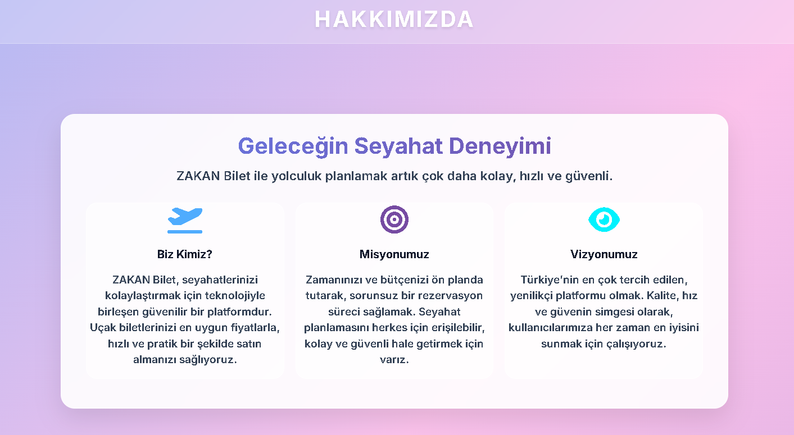
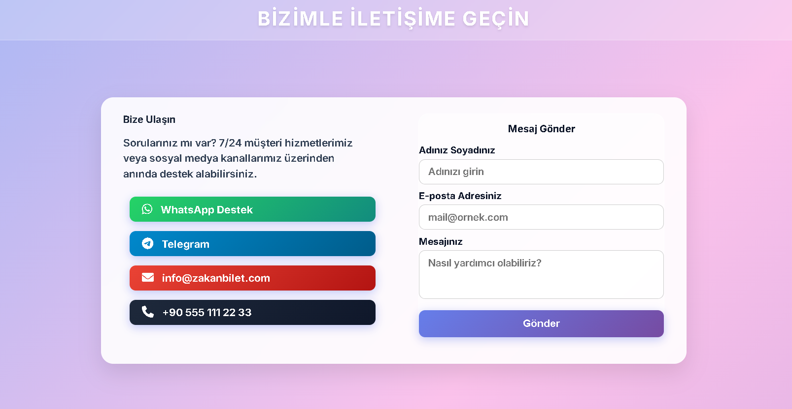
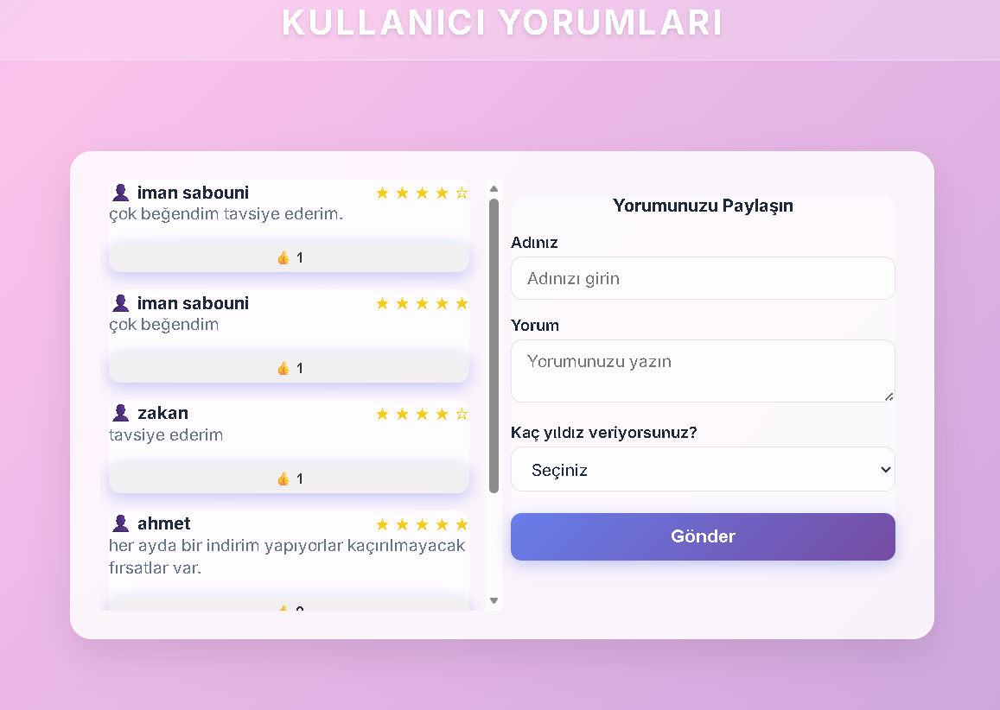

# Flight Ticket Reservation System

A web-based flight ticket reservation system developed using HTML, CSS, JavaScript, Python, and SQLite.

## Overview

This project provides a simple flight booking experience through a user-friendly web interface. Users can register, log in, browse available flights, select seats, enter passenger information, complete payments, and view special offers.

## Features

- User registration and login
- Flight booking interface
- Seat selection
- Passenger information management
- Payment page
- Special offers and discounts
- User account management
- Customer reviews
- Contact and About pages
- SQLite database integration

## Technologies

| Technology | Purpose |
|------------|---------|
| HTML5 | Page structure |
| CSS3 | User interface styling |
| JavaScript | Client-side functionality |
| Python | HTML update utilities |
| SQLite | Database |

## Project Structure

```text
Flight-Ticket-Reservation-System/
├── images/
├── giris.html
├── kayit.html
├── hesap.html
├── koltuklar.html
├── yolcu.html
├── kartodeme.html
├── odeme2.html
├── firsat.html
├── indirimler.html
├── hakkimizda.html
├── iletisim.html
├── yorumlar.html
├── sifre.html
├── style.css
├── remove_glow.js
├── update_footer.js
├── update_html.js
├── update_html.py
├── zakan.sqlite
└── README.md
```

## Screenshots

| Login | Seat Selection |
|-------|----------------|
|  |  |

| Passenger Information | Payment |
|-----------------------|---------|
|  |  |

| Account | Discounts |
|---------|-----------|
|  |  |

| About | Contact |
|-------|----------|
|  |  |

| Customer Reviews |
|------------------|
|  |

## Getting Started

### Requirements

- Any modern web browser

### Installation

```bash
git clone https://github.com/imansabouni/Flight-Ticket-Reservation-System.git
```

Open the project folder and launch the HTML files in your preferred browser.

## Project Purpose

This project was developed as an educational web application to simulate the complete workflow of a flight ticket reservation system, including booking, seat selection, passenger information, and payment.

## License

This project was developed for educational purposes.